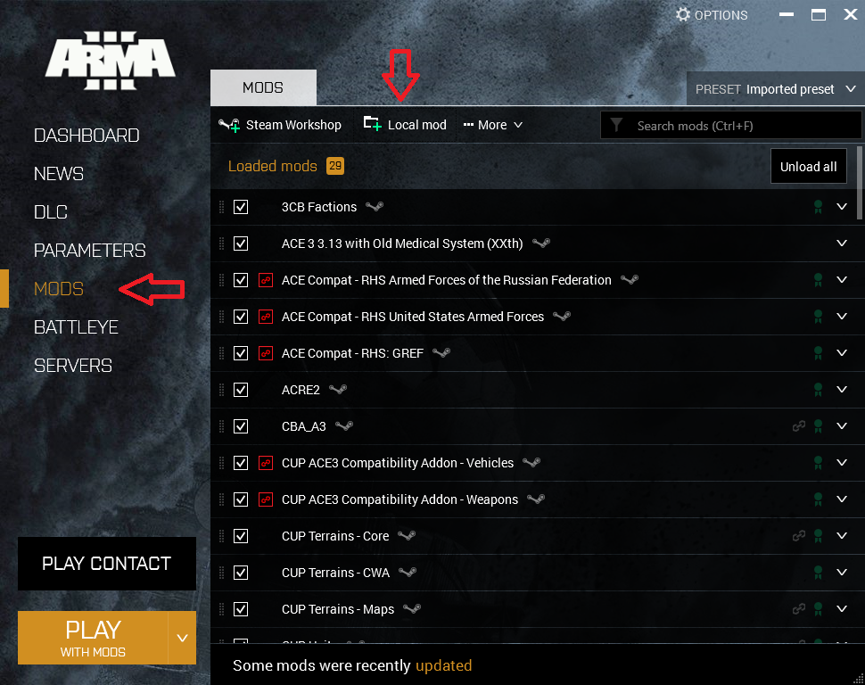
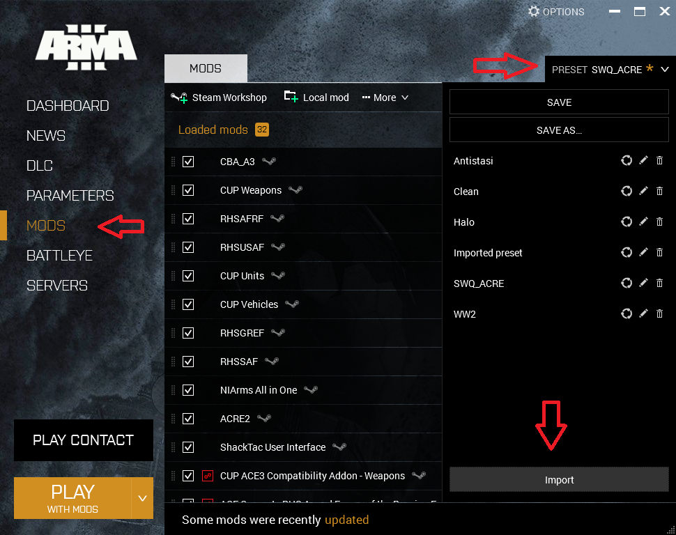

Bad Dudes has a regular mod list that is occasionally modified on a session by session basis. Check the `#announcements` channel of the Discord server at least a day prior to the session to download and test any additional mods needed for the session.

Mod lists can be exported and imported by the Arma launcher as HTML files. These mod list files can be opened in your browser to view a list of mods with links to each mod's Steam Workshop page. These files can also be imported directly into the Arma launcher.

## Required Files

Download the mod list file and the only mod in our mod list not present on the Steam Workshop.

1. [Bad Dudes Mod List](assets/mod-installation/bad-dudes-mod-list.html)
2. [Killoch's Multi-National Pack](http://www.armaholic.com/page.php?id=26666)

## Local Mod Installation

Our mod list contains one mod that isn't present on the Steam Workshop, Killoch's Multi-National Pack. This must be added to the Arma launcher as a local mod.

1. Download the mod from the Armaholic link above.
2. Extract the `@K_MNP` directory from the RAR archive.
3. Move the `@K_MNP` directory to your Arma installation directory. This is commonly `<steam-install-directory>\steamapps\common\Arma 3`.
4. Launch Arma 3 and select `MODS` on the left column of the Arma launcher.
5. Click the `Local Mod` button at the top.
6. Navigate to the `@K_MNP` directory in your Arma installation and click `Select folder`.

## Importing the mod list

Importing the mod list into the Arma launcher will automatically subscribe you to the mods in the Steam Workshop and begin downloading the mods.

1. Launch Arma 3 and select `MODS` on the left column of the Arma Launcher.
2. Open the preset list at the top right.
3. Click the `Import` button at the bottom of the preset list.
4. Navigate to the `bad-dudes-mod-list.html` file you downloaded and click open.

Note that once installation of the mods is finished you will have multiple warnings for mods with unmet dependencies.You may ignore these errors and when prompted you should not select the option to automatically setup the missing depdendencies. The mod list contains a number of alternate versions of mods that will not match the exact dependencies specified in other mods but will provide the same functionality.

## Additional mods

Bad Dudes regularly uses a set of maps that aren't required for every session and are not included in the main mod list. An annoucement prior to the session will be made if the one of these maps is required. If you like, you can subscribe to these Steam Workshop items to have them ready to go.

* [Angola Maps](https://steamcommunity.com/sharedfiles/filedetails/?id=1446500688)
* [Bozcaada](https://steamcommunity.com/sharedfiles/filedetails/?id=5246226280)
* [PKL LEGACY VERSION](https://steamcommunity.com/sharedfiles/filedetails/?id=950966660)
* [Ruha](https://steamcommunity.com/sharedfiles/filedetails/?id=1368857262)
* [VIDDA | LEGACY VERSION](https://steamcommunity.com/sharedfiles/filedetails/?id=1282716647)

